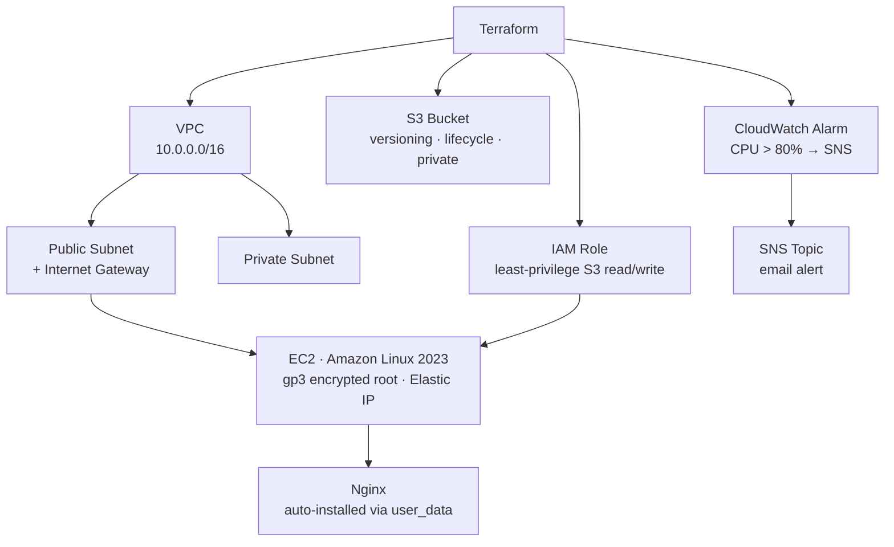

# Terraform AWS DevOps Lab

[](https://github.com/gaurav-sng2002/terraform-aws-devops-lab/actions)


Full AWS infrastructure lab in Terraform — from zero to a running Nginx server with monitoring, alerting, and a hardened S3 bucket, all in one `terraform apply`.

> **Study the code without spending money.** `terraform plan` shows every resource. `terraform apply` only when you're ready.

---

## What gets created



---

## Resources created by `terraform apply`

| Resource | Type | Description |
|----------|------|-------------|
| `aws_vpc.main` | Network | `/16` CIDR with DNS enabled |
| `aws_subnet.public` | Network | Public subnet in `{region}a` |
| `aws_subnet.private` | Network | Private subnet in `{region}b` |
| `aws_internet_gateway.igw` | Network | Routes public traffic |
| `aws_security_group.ec2` | Security | SSH (restricted) · HTTP · HTTPS |
| `aws_instance.main` | Compute | Amazon Linux 2023 · `t3.micro` · 20 GB gp3 encrypted |
| `aws_eip.main` | Network | Static Elastic IP |
| `aws_key_pair.main` | Auth | SSH key pair |
| `aws_iam_role.ec2` | IAM | EC2 assume role |
| `aws_iam_role_policy.s3` | IAM | Least-privilege S3 GetObject/PutObject/ListBucket |
| `aws_s3_bucket.artifacts` | Storage | Private · versioned · Glacier lifecycle at 90 days |
| `aws_cloudwatch_metric_alarm.cpu_high` | Monitoring | CPU > 80% for 4 min → SNS |
| `aws_sns_topic.alerts` | Alerting | Email subscription |

---

## Quick start

```bash
git clone https://github.com/gaurav-sng2002/terraform-aws-devops-lab
cd terraform-aws-devops-lab

# 1. Configure
cp terraform.tfvars.example terraform.tfvars
# Edit: aws_region, key_name, public_key_path, alert_email, allowed_ssh_cidr

# 2. Init + validate (free — no AWS calls)
terraform init
terraform validate
terraform fmt -check

# 3. Preview (free — no resources created)
terraform plan

# 4. Apply (creates real AWS resources — incurs cost)
terraform apply
```

---

## terraform output (after apply)

```
instance_public_ip    = "13.235.101.42"
instance_id           = "i-0abc123def456789"
s3_bucket_name        = "devops-lab-prod-artifacts-a1b2c3d4"
vpc_id                = "vpc-0a1b2c3d4e5f67890"
cloudwatch_alarm_name = "devops-lab-prod-cpu-high"
sns_topic_arn         = "arn:aws:sns:ap-south-1:123456789012:devops-lab-prod-alerts"
ssh_command           = "ssh -i ~/.ssh/devops-lab.pem ec2-user@13.235.101.42"
nginx_url             = "http://13.235.101.42"
```

---

## Variables reference

| Variable | Default | Description |
|----------|---------|-------------|
| `aws_region` | `ap-south-1` | AWS region to deploy into |
| `project_name` | `devops-lab` | Prefix for all resource names |
| `environment` | `prod` | Environment tag |
| `instance_type` | `t3.micro` | EC2 instance type |
| `allowed_ssh_cidr` | `0.0.0.0/0` | **Change to your IP** for production |
| `key_name` | — | SSH key pair name in AWS |
| `public_key_path` | — | Path to your `.pub` key file |
| `alert_email` | — | Email for CloudWatch → SNS alerts |

---

## Security design decisions

| Decision | Why |
|----------|-----|
| `allowed_ssh_cidr` variable | Forces you to restrict SSH — never hardcoded to `0.0.0.0/0` |
| `encrypted = true` on root EBS | Encryption at rest, no extra cost |
| IAM least-privilege policy | EC2 can only touch its own S3 bucket |
| S3 `block_public_acls = true` | No accidental public object exposure |
| S3 versioning enabled | Accidental delete protection |
| S3 Glacier lifecycle at 90 days | Cost optimization built-in |

---

## Teardown

```bash
terraform destroy
```
All resources are destroyed cleanly. The S3 bucket has `force_destroy = true` for lab convenience.

---

## Roadmap

- [ ] Remote state with S3 backend + DynamoDB locking
- [ ] ALB + auto-scaling group
- [ ] RDS instance with subnet group
- [ ] Terraform modules refactor (`modules/networking`, `modules/compute`)
- [ ] GitHub Actions workflow for `terraform plan` on PRs
