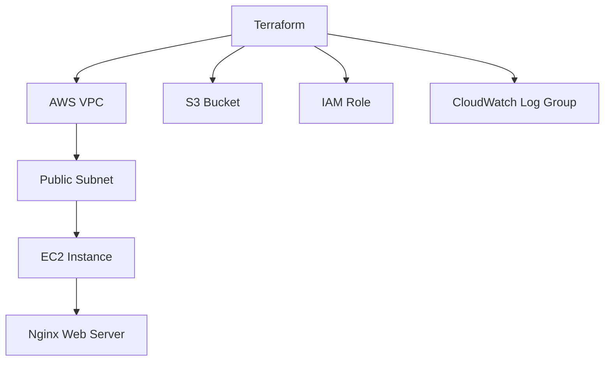

# Terraform AWS DevOps Lab

Terraform-based AWS infrastructure lab for creating a basic cloud hosting environment with VPC, subnet, EC2, security group, IAM role, S3 bucket, CloudWatch log group, and Nginx bootstrap.

## Architecture



## What this demonstrates

- Infrastructure as Code using Terraform.
- AWS networking fundamentals.
- EC2 provisioning and bootstrap scripts.
- Security group configuration.
- CloudWatch and S3 awareness.
- CI checks for Terraform format and validation.

## Commands

```bash
terraform init
terraform fmt
terraform validate
terraform plan
```

Apply only when you understand AWS billing and have configured credentials safely:

```bash
terraform apply
terraform destroy
```

## Security notes

- Never commit AWS access keys.
- Use least-privilege IAM users or roles.
- Restrict SSH access instead of using `0.0.0.0/0` in production.
- Use remote state with locking for team environments.
